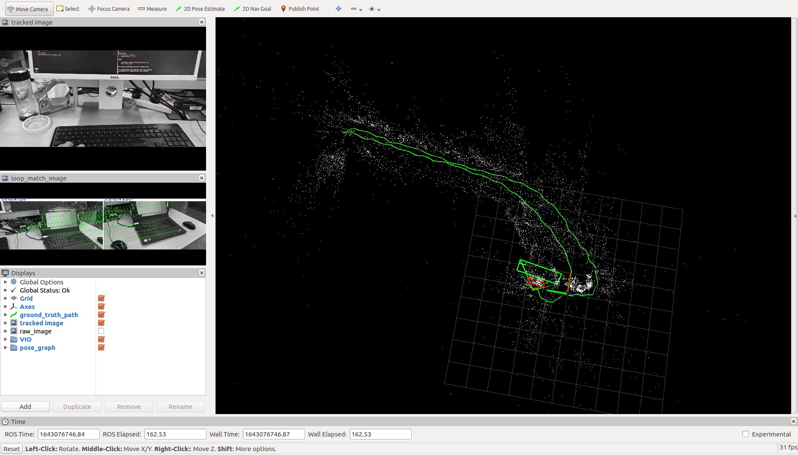

# VINS-Mono-Android
录制Android手机的图像和IMU数据，标定并运行VINS-Mono

# 标定
手机采集图像和IMU数据
https://github.com/hitcm/Android_Camera-IMU

Kalibr（用于标定cam和cam+imu）
https://github.com/ethz-asl/kalibr

imu_utils（用于标定imu）
https://github.com/gaowenliang/imu_utils

单目cam标定
```
rosrun kalibr kalibr_calibrate_cameras --bag /home/xx/camimu.bag --topics /cam0/image_raw --models pinhole-radtan --target /home/xx/aprilgrid.yaml
```

imu标定
```
roslaunch imu_utils android.launch
rosbag play imu.bag
```

cam+imu标定
```
rosrun kalibr kalibr_calibrate_imu_camera --bag /home/xx/camimu.bag --target /home/xx/aprilgrid.yaml --cam /home/xx/camchain.yaml --imu /home/xx/imu.yaml
```

#测试
将上述所有cam和imu相关内参和外参，写入vins-mono的config文件中，进行测试。
```
roslaunch vins_estimator android.launch
roslaunch vins_estimator vins_rviz.launch
rosbag play camimu.bag
```

